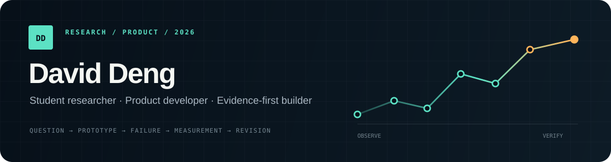

[English](README.md) · [简体中文](README.zh-CN.md)



# David Deng

[Portfolio · Research & Product Lab](https://daviddeng1222.github.io/)

我是一名高一学生，围绕计算机视觉、原生应用与以人为本的产品开展研究和开发。关注从问题定义、原型实现到测试与迭代的完整过程，让每一项技术主张都有证据可追溯。

**Student researcher and product developer working across computer vision, native apps and human-centered systems.**

I am a Grade 10 student in China. I like problems where a polished answer is not enough: the result should be traceable to evidence, the failure boundary should be visible, and the product should remain understandable to the person using it.

## Selected work

### [Motus — badminton motion laboratory](https://github.com/DavidDeng1222/motus-showcase)

A local-first SwiftUI prototype connecting source video, 2D pose evidence, selected-athlete 3D replay and racket-direction research on one timeline.

- 38 test suites and 3,838 deterministic engineering checks in the latest recorded run
- synchronized AVFoundation replay, Apple Vision analysis and SceneKit presentation
- failure cases, rejected candidates and display/measurement provenance preserved as research evidence
- public repository contains a reviewed case study; core algorithms and raw archives remain private

### [Elder-Friendly Offline Games](https://github.com/DavidDeng1222/cognitive-wellness-case-study)

An anonymized cross-platform product case for older adults in public-service waiting environments.

- seven recreational games and four difficulty levels
- SwiftUI for iOS/iPadOS; Flutter shared across Android and Windows
- offline-first, no account, no cloud score service, no camera/microphone/location permission
- large type, high contrast, generous targets and non-punitive feedback

Institutional branding, private deployment material and client-specific content are excluded from the public case study.

## How I work

```text
question → observable → prototype → failure test → measurement → revision
```

I keep source timestamps, rejected outputs, build logs and test evidence because they make an engineering claim easier to challenge and improve. I separate implemented behavior, research hypotheses and pending validation in my project notes.

## Technical range

| Area | Tools and practice |
|---|---|
| Apple platforms | Swift, SwiftUI, AVFoundation, Vision, SceneKit, Core ML integration |
| Cross-platform products | Flutter, Dart, Android and Windows release workflows |
| Research engineering | experiment design, source provenance, failure analysis, deterministic checks |
| Product design | accessibility, local-first privacy, replay UX, evidence-linked feedback |

## Contribution disclosure

I define the product direction, research questions, user experience, evidence boundaries and acceptance decisions; I also review test material and investigate failures. AI tools are used as engineering collaborators for implementation, critique and debugging. Public claims are included only when I can connect them to a build, test or retained source record.

## Current focus

- improving continuous badminton replay without inflating recognition counts;
- evaluating when wrist and forearm geometry can support a clearly labelled racket-direction aid;
- designing public artifacts that remain useful while protecting private source and third-party rights.

<sub>Based in China · Building in English and Chinese · GitHub: @DavidDeng1222</sub>
